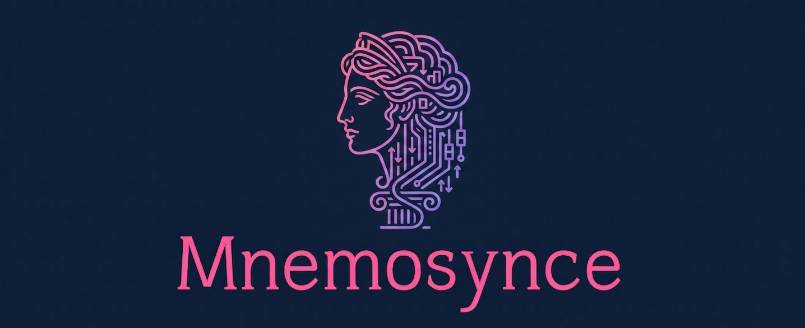

# Mnemosynce

**Remember everything.**

A beautiful, reliable backup orchestrator for Linux home servers. Mnemosynce (Mnemosyne + Sync) creates dated snapshots with `rsync`, enforces smart retention policies, syncs to remote storage, and keeps you informed via email — all managed through a clean web dashboard.

*Ancient memory meets modern sync*



## ✨ Features

- **Snapshot backups** — Efficient daily/weekly/monthly/yearly snapshots using `rsync` + hard links
- **Smart retention** — Automatically prunes old backups according to your policy
- **Remote sync** — Securely mirrors everything to a secondary location over SSH
- **Web dashboard** — Real-time status, history, configuration editor, and progress monitoring
- **Guided setup** — First-time wizard walks you through configuration, SSH keys, and scheduling
- **Scheduled runs** — Built-in APScheduler with flexible cron-style timing
- **Email reports** — Rich HTML summaries with log attachments on failures
- **Multi-source** — Supports local paths and remote SSH sources (`user@host:/path`)

## 🎨 Design

- **Colors**: Deep mythological blues & purples with vibrant teal accents
- **Vibe**: Calm, trustworthy, timeless — like an ancient library that never forgets

## 📖 Documentation

Full user and developer documentation is available at the project's GitHub Pages site.
See `docs-site/` for the source, built with [Zensical](https://zensical.org).

## 📥 Quick start

### Docker (recommended)

```bash
docker run -d \
  --name mnemosynce \
  -v ./data:/data \
  -p 5000:5000 \
  -e SECRET_KEY=change-me \
  -e ADMIN_PASSWORD=change-me \
  -e GMAIL_ADDRESS=you@gmail.com \
  -e GMAIL_PASSWORD=your-app-password \
  ghcr.io/mark-me/mnemosynce:latest
```

Then open [http://your-server:5000](http://your-server:5000) and follow the setup wizard.

> **Note** — `SECRET_KEY` and `ADMIN_PASSWORD` must be changed from the defaults.
> The container will refuse to start in production if they are left as placeholders.

### Manual installation

```bash
git clone https://github.com/mark-me/mnemosynce.git
cd mnemosynce
uv sync
cp .env.example .env   # fill in your values
```

Start the development server:

```bash
uv run flask --app src/web/app:create_app run --host 0.0.0.0 --port 5000
```

Or use Gunicorn for production:

```bash
uv run gunicorn \
  --bind 0.0.0.0:5000 \
  --workers 2 \
  --timeout 120 \
  "web.app:create_app()"
```

## ⚙️ Configuration

All persistent data lives in the `/data` volume (or `dev-data/` in development):

| Path | Purpose |
|------|---------|
| `backup_config.yml` | Backup task definitions |
| `log.db` | Run history for the dashboard |
| `ssh/` | SSH keypairs managed via the web UI |
| `schedule.json` | Saved cron schedule |

Example `backup_config.yml`:

```yaml
dir_backup_local: /mnt/backup/local
dir_backup_remote: user@backup-host:/mnt/backup/remote

email_sender: you@gmail.com
email_report: you@example.com

tasks:
  - name: Documents
    dir_source: /home/user/Documents
    excludes:
      - "*.tmp"
      - "cache/"

  - name: DesktopHome
    dir_source: user@desktop:/home/user   # remote source over SSH
    excludes:
      - Downloads/*
      - .cache
```

## 🛠️ Development

Install dev dependencies:

```bash
uv sync --extra dev
```

Start the dev server (login is bypassed in development mode):

```bash
uv run flask --app src/web/app:create_app run --debug
```

Run the test suite:

```bash
uv run pytest -m "not functional"          # fast, no real scripts needed
uv run pytest --cov=src --cov-report=term-missing -m "not functional"
```

## 🗂️ Project structure

```text
mnemosynce/
├── src/
│   ├── backup_server/         # Core backup engine — no Flask dependency
│   │   ├── backup_task.py     # Orchestrates one task: backup → retention → sync
│   │   ├── config_file.py     # Reads and validates backup_config.yml
│   │   ├── database.py        # SQLite run log
│   │   ├── email_report.py    # Composes and sends the HTML status email
│   │   └── main.py            # CLI entry point
│   ├── config/
│   │   └── config.py          # Flask config classes (Dev / Test / Production)
│   └── web/
│       ├── app.py             # Flask application factory
│       ├── scheduler.py       # APScheduler singleton + live log bridging
│       ├── setup_state.py     # Session-backed setup readiness checks
│       └── routes/            # One blueprint per feature area
├── backup.sh                  # rsync snapshot script
├── delete_old_backups.sh      # Retention policy script
├── sync_backup_to_remote.sh   # Remote sync script
├── docs-site/                 # Zensical documentation source
│   ├── zensical.toml
│   └── docs/
│       ├── user/              # User guide
│       └── developer/         # Developer guide
├── tests/                     # pytest suite (88 tests, no real I/O)
├── docker/Dockerfile
└── pyproject.toml
```

## ⚖️ License

MIT © 2026 Mark Zwart

---

*"Your data's eternal memory keeper."*
