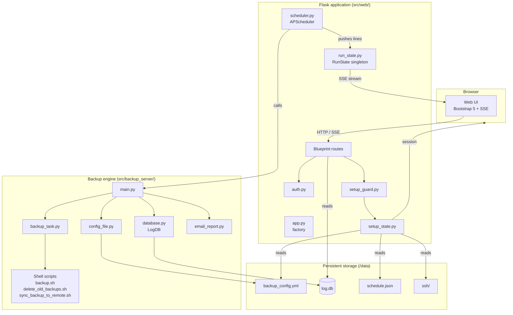
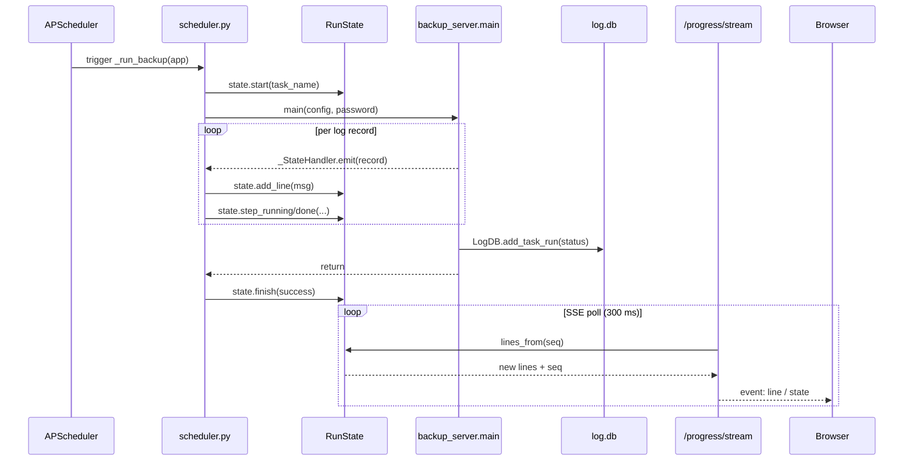

# Architecture

## Component map

## Request lifecycle

A typical page request goes through four layers:

1. **`@login_required`** — redirects to `/login` if the session has no `logged_in` flag (production only; bypassed in development).
2. **`@setup_complete_required`** — redirects to `/setup/` if `is_setup_complete()` returns False. Applied to all operational routes (dashboard, progress, schedule run/status).
3. **Route handler** — fetches data, renders template.
4. **Context processor** (`inject_setup_status`) — injects `setup_status` and `setup_complete` into every template so `base.html` can render the correct navbar without per-route logic.

## Threading model

The Flask development server and Gunicorn (with `--workers 2`) are both multi-threaded. Two threads can be active simultaneously:

| Thread | Writer | Reader |
|--------|--------|--------|
| Backup runner (APScheduler or manual) | `RunState.add_line()`, `RunState.step_*()` | — |
| Flask SSE handler (`/progress/stream`) | — | `RunState.lines_from()`, `RunState.snapshot()` |

`RunState` uses a `threading.Lock` on every mutation and read. The lock is held only for the duration of a list slice or attribute set — never across I/O — so contention is negligible.

## Data flow: a scheduled backup run

