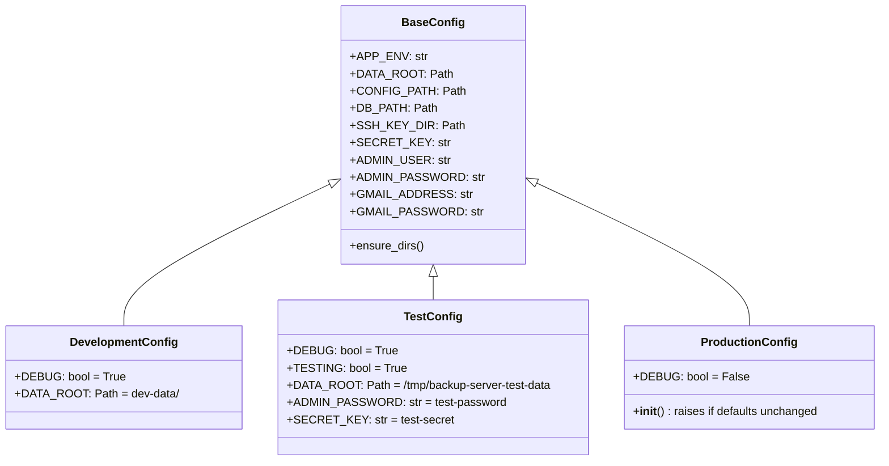

# Configuration reference

Flask configuration is handled by three config classes in `src/config/config.py`, selected by the `APP_ENV` environment variable.

## Config classes



Selected by `get_config()`:

```python
env = os.getenv("APP_ENV", "development")
# "development" → DevelopmentConfig
# "test"        → TestConfig
# "production"  → ProductionConfig
```

---

## Environment variables

All configuration values are read from environment variables (or from `.env` in development via `python-dotenv`).

### Required in production

| Variable | Description |
|----------|-------------|
| `SECRET_KEY` | Flask session signing key. Must be a long random string. `ProductionConfig.__init__()` raises `RuntimeError` if still set to the default placeholder. |
| `ADMIN_PASSWORD` | Web UI admin password. Same guard as `SECRET_KEY`. |

### Optional

| Variable | Default | Description |
|----------|---------|-------------|
| `APP_ENV` | `development` | Selects the config class. |
| `ADMIN_USER` | `admin` | Web UI username. |
| `GMAIL_ADDRESS` | `""` | Gmail sender address, used as SMTP username. |
| `GMAIL_PASSWORD` | `""` | Gmail app password (or the content of `GMAIL_PASSWORD_FILE`). |
| `DATA_ROOT` | `/data` (production), `dev-data/` (development) | Root directory for all persistent data. |

### `GMAIL_PASSWORD_FILE` (CLI mode only)

When running the backup engine directly from the command line, the Gmail password is read from a file, not an env var directly:

```bash
export GMAIL_PASSWORD_FILE=/etc/mnemosynce/gmail-password
uv run python -m backup_server.main config.yml
```

This is handled by `_read_password()` in `main.py`. The web app reads the password directly from `GMAIL_PASSWORD` in the Flask config instead.

---

## Derived paths

`BaseConfig` derives three paths from `DATA_ROOT`. Override `DATA_ROOT` to move all state to a different location; the derived paths follow automatically.

| Attribute | Derived as | Purpose |
|-----------|-----------|---------|
| `CONFIG_PATH` | `DATA_ROOT / "backup_config.yml"` | Backup task definitions |
| `DB_PATH` | `DATA_ROOT / "log.db"` | SQLite run history |
| `SSH_KEY_DIR` | `DATA_ROOT / "ssh"` | Generated SSH keypairs |

`ensure_dirs()` creates `DATA_ROOT` and `SSH_KEY_DIR` if they do not exist. Called once at application startup by `create_app()`.

---

## Development mode behaviour

When `APP_ENV=development`:

- `login_required` is a no-op — all routes are accessible without a session.
- `DATA_ROOT` defaults to `dev-data/` inside the project root.
- `DEBUG=True` enables the Werkzeug reloader and detailed error pages.
- `.env` is loaded automatically from the project root by `python-dotenv`.

---

## Adding a new config value

1. Add a class attribute to `BaseConfig` with an `os.getenv(...)` default.
2. Override it in `DevelopmentConfig` and `TestConfig` as needed.
3. If the value must not be left as a placeholder in production, add a guard to `ProductionConfig.__init__()`.
4. Access it in Flask code via `current_app.config["MY_VALUE"]` or `app.config["MY_VALUE"]`.

```python
# In BaseConfig
MY_VALUE: str = os.getenv("MY_VALUE", "default")

# In ProductionConfig.__init__
if self.MY_VALUE == "default":
    raise RuntimeError("MY_VALUE must be set in production.")
```
