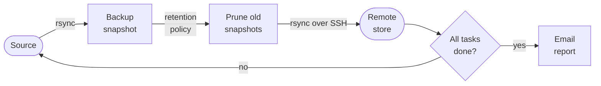

# Mnemosynce

Mnemosynce is a **backup orchestrator for Linux home servers**. It runs a set of rsync tasks defined in a YAML config file, applies a tiered retention policy, syncs everything to a remote machine, and emails you a status report after every run — all from a self-hosted web interface.

-   :material-book-open-variant: **User guide**

    ---

    Install, configure, and operate Mnemosynce from the web UI. No prior Python knowledge needed.

    [:octicons-arrow-right-24: Get started](user/index.md)

-   :material-code-braces: **Developer guide**

    ---

    Understand the architecture, extend the code, and contribute. Covers every module, the test suite, and deployment.

    [:octicons-arrow-right-24: Architecture overview](developer/index.md)

## How a backup run works

Each run executes three steps per configured task, in order:

| Step | What happens |
|------|-------------|
| **Backup** | `rsync` from source to a dated snapshot directory, using hard links so unchanged files cost no extra space |
| **Retention** | Removes snapshots outside the configured window (daily × 7, weekly × 4, monthly × 12, yearly × 5) |
| **Sync** | `rsync` the local backup directory to a remote machine over SSH |

After all tasks finish, an HTML email report summarises what succeeded and what failed, with log files attached for any failed steps.
